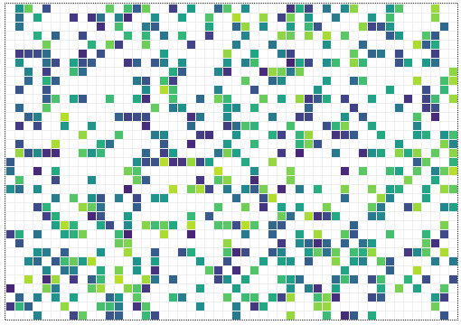

# Adaptive Daisyworld

An implementation of the agent based model (ABM) ["Daisy World"](https://en.wikipedia.org/wiki/Daisyworld) with evolving daisys, using [mesa](https://github.com/projectmesa/mesa). The original model was aimed at showing how living organism can change the environment on a global scale (Watson & Lovelock, 1983).   This model rather shows how organisms adapt and conquer a habitat. Simulates a spherical world, with solar energy getting weaker towards poles (upper and lower border) and being maximal at equator (middle)

## Launch the model:
Adapt the dimensions of the model in server.py. The dimensions of the model can have major impact on the behaviour, affecting the heat gradient and the relative influence sphere of each cell (togeher with "Radius of heat integration")

    $ python3 run.py

A browser window should open automatically (http://127.0.0.1:8521/). Adapt parameters and press Reset, then Run.

## Reference

Watson, A. J., & Lovelock, J. E. (1983). Biological homeostasis of the global environment: the parable of Daisyworld. Tellus B: Chemical and Physical Meteorology, 35(4), 284-289.
